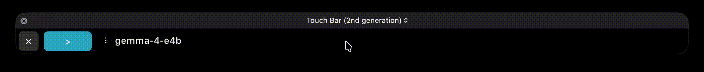
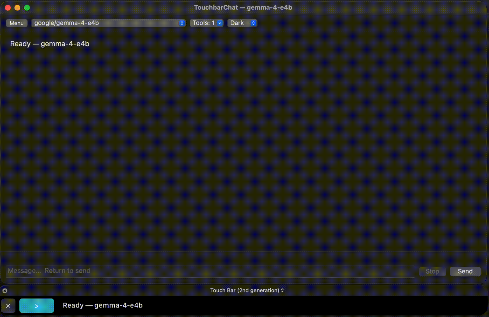

# TouchBar Chat

Menu-bar macOS app that puts a local **[LM Studio](https://lmstudio.ai)** chat on the **Touch Bar** (MacBook Pro with Touch Bar). 

**Backend:** LM Studio only (`http://127.0.0.1:1234` by default). No cloud providers.

**License:** [MIT](LICENSE)

Bundle identifier: `com.touchbarchat.app`





---

## Requirements

- MacBook Pro **with Touch Bar**
- **macOS 13+**
- [LM Studio](https://lmstudio.ai) with a model loaded and the **local server** started
- Apple **Command Line Tools** or Xcode (to build)

---

## Features

### Touch Bar

- Presented automatically on launch; **Control Strip** icon brings it back later
- Stays up until you dismiss with the custom close control (**×**)
- **Ask (`>`)** — floating input panel (Return send, Esc cancel, paste supported)
- **Message strip** — scrollable reply preview; braille spinner while waiting; tap opens the chat window
- Optional **Hide Control Strip** for a wider bar (menu bar toggle)

### Menu bar

- Show Touch Bar, Chat Window…, Ask…, New Chat
- **> Button Color**, Font Size, Chat Theme (Dark / Light / Matrix)
- Hide Control Strip
- **Tools (MCP)** — enable plugins from `~/.lmstudio/mcp.json`
- **Instructions** - similiar to agents.md 

---

## LM Studio setup

1. Open LM Studio → load a model → **start the local server** (Developer / Server; default `http://127.0.0.1:1234`). Loading a model alone is not enough.
2. Build and run this app (below).
3. Menu bar → **Settings…** → set base URL if needed → **Refresh models** → pick a model → **Save**. (Optional: **Start server** if `lms` is installed.)
4. Use Control Strip icon, **Show Touch Bar**, or **Chat Window…**.

### MCP tools (optional)

If you enable **Tools (MCP)** and get HTTP **403**:

1. LM Studio → Server Settings → allow calling servers from `mcp.json`
2. Create an API token with plugin permission
3. Paste the token in **Settings…**
4. Or turn off **Enable Tools** for plain chat

Plugins are discovered from `~/.lmstudio/mcp.json` (ids like `mcp/brave-search`).

---

## Build / run

```bash
chmod +x build.sh
./build.sh
open build/TouchBarChat.app
```

`build.sh` prefers Command Line Tools’ `swiftc` and SDK, links private `DFRFoundation` + `Security`, and ad-hoc codesigns the `.app`. Missing `swiftc`/SDK or a codesign failure aborts the build.

Override if needed:

```bash
SWIFTC=/path/to/swiftc SDK=/path/to/MacOSX.sdk TARGET=arm64-apple-macos13.0 ./build.sh
```

On first launch after upgrade, a token previously saved in UserDefaults (including the old `local.touchbar.chat` prefs domain) is migrated into the Keychain and removed from defaults.

---

## Project layout

```
Package.swift              SPM package (TouchBarChatCore + tests)
Sources/TouchBarChatCore/  Pure LM Studio / markdown / MCP logic (no AppKit)
Tests/TouchBarChatCoreTests/
App/Sources/               AppKit menu bar + Touch Bar UI
App/Resources/Info.plist
build.sh                   Compile Core library + app (same swiftc)
LICENSE                    MIT
```

### Tests

```bash
swift test
```


